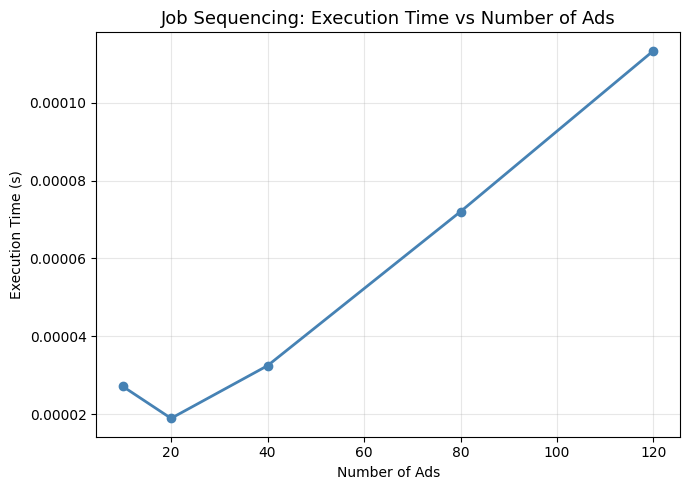
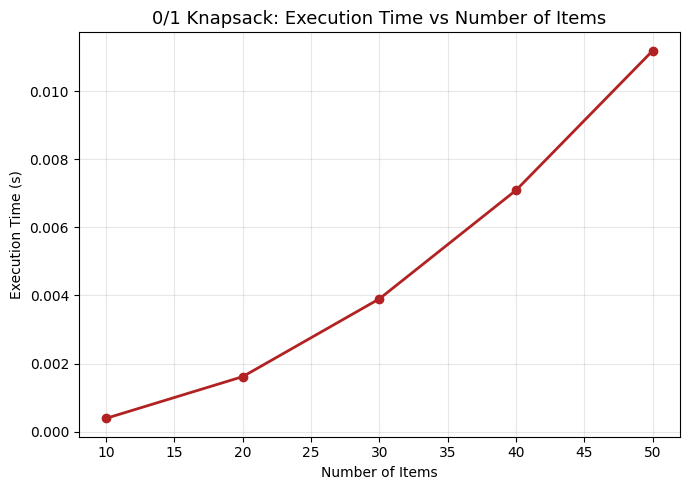
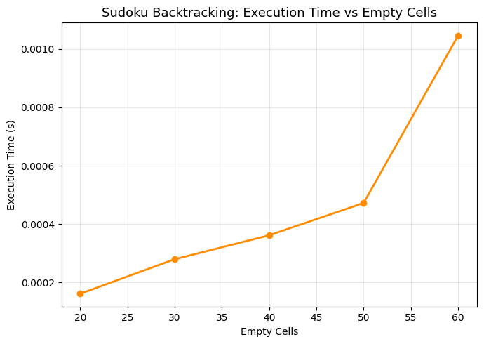
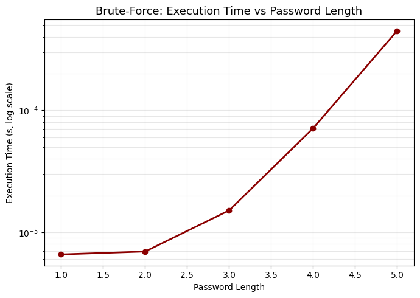

# Algorithmic Strategies: Lab Assignment 2

A practical, end-to-end implementation of **four real-world problems** using **Greedy**, **Dynamic Programming**, **Backtracking**, and **Brute-Force**, with **runnable demos**, **performance plots**, and **concise trade-off analyses**.

---

## Project Objectives

- Apply core algorithmic characteristics (**finiteness**, **input/output**, **definiteness**, **effectiveness**) to real scenarios.
- Implement canonical strategies and **visualize performance trends** with reproducible plots.
- Communicate **suitability and trade-offs** for scheduling, budgeting, constraint satisfaction, and security tasks.

---

## Repository Layout

```
algo_strategies_notebook.ipynb  — implementations, demonstrations, plots, and analysis for all four problems.
images/                         — exported figures produced by the notebook (PNG).
requirements.txt                — minimal dependencies for local execution.
README.md                       — this document.
```

---

## Setup

Create and activate a virtual environment.

### macOS/Linux:
```bash
python -m venv venv && source venv/bin/activate
```

### Windows (PowerShell):
```powershell
python -m venv venv; .\venv\Scripts\Activate.ps1
```

Install dependencies:
```bash
pip install -r requirements.txt
```

Launch Jupyter and open the notebook:
```bash
jupyter notebook
```

---

## How to Run

Run all cells in `algo_strategies_notebook.ipynb` from top to bottom. This will:

1. Validate the environment and imports.
2. Define each problem’s algorithm with **docstrings** and **complexity notes**.
3. Execute **demos** for realistic inputs and print readable summaries.
4. Generate and save **performance figures** to `images/` with descriptive filenames.

---

## Implemented Problems

| Problem | Strategy |
|--------|----------|
| **TV Commercial Scheduling** | Greedy (Job Sequencing with deadlines and profits) |
| **Budget-Constrained Profit Maximization** | Dynamic Programming (0/1 Knapsack) |
| **Sudoku Solver** | Backtracking on a 9×9 grid with validity checks |
| **Password Cracking (Naive)** | Brute-Force over a provided character set |

---

## Reproducible Profiling

- **Time**: High-resolution monotonic timing across input scales.
- **Inputs**: Deterministic generation where applicable for fair comparisons.
- **Figures**: Exported at `dpi=150` with `bbox_inches='tight'` for clarity.

---

## Plots Generated

The notebook produces and saves performance figures illustrating **runtime trends** and **output quality**.

### TV Commercial Scheduling (Greedy)
  
  → Execution time vs number of ads; total revenue vs scale.

> **Insight**: Sorting dominates runtime; greedy slotting yields strong revenue under tight deadlines.

---

### 0/1 Knapsack (Dynamic Programming)
  
  → Execution time vs number of items; maximum profit vs items.

> **Insight**: Pseudo-polynomial scaling in capacity; returns **optimal selection** for discrete budgets.

---

### Sudoku Solver (Backtracking)


  → Time vs empty cell count (difficulty proxy).

> **Insight**: Branching grows with fewer constraints; **pruning via row/column/box checks is critical**.

---

### Password Cracking (Brute-Force)


  → Attempts and time vs password length (**log scale**).

> **Insight**: Exponential growth with length and charset demonstrates **strong-password necessity**.

---

## Theoretical Complexities

| Problem | Strategy | Best | Average | Worst | Space | Notes |
|--------|----------|------|---------|-------|-------|-------|
| **TV Commercial Scheduling** | Greedy | O(n log n) | O(n log n) | O(n²) | O(n) | Sort by profit; fill latest free slot before deadline |
| **0/1 Knapsack** | DP | O(nW) | O(nW) | O(nW) | O(nW) or O(W) | Optimal for discrete items under budget |
| **Sudoku Solver** | Backtracking | O(1) | O(9ᵐ) | O(9ᵐ) | O(m) | m = number of blanks; strong pruning helps |
| **Password Cracking** | Brute-Force | O(1) | O(c^(n/2)) | O(cⁿ) | O(n) | c = charset size, n = length; exhaustive |

---

## Suitability and Trade-offs

| Strategy | Best For | Trade-offs |
|--------|----------|-----------|
| **Greedy scheduling** | Fast decisions with unit-time slots & deadlines | May miss optimal if non-unit times or complex constraints |
| **DP knapsack** | Optimal selection under discrete budgets | Memory/time grows with capacity |
| **Sudoku backtracking** | Complete constraint satisfaction | Can be slow on very sparse boards |
| **Brute-force cracking** | Simplicity in small search spaces | **Exponential blowup** → motivates stronger passwords |

---

## Observed vs Expected

- **Greedy scheduling**: Follows O(n log n) with minor overhead from slot placement.
- **Knapsack DP**: Scales predictably and matches **optimal profits** in demos.
- **Sudoku**: Time rises with emptiness; constraint pruning improves **practical performance**.
- **Brute-force**: Time grows **exponentially** with password length even for small charsets.

---

## File Naming

Figures saved with **descriptive names** matching each problem:

```
job_sequencing_performance.png
knapsack_performance.png
sudoku_performance.png
password_cracking_performance.png
```

> Recommended: `dpi=150` and `bbox_inches='tight'` for consistent quality.

---

## Re-running and Reproducibility

- Fix seeds where random data is used to **stabilize comparisons**.
- Keep scale lists (e.g., item counts, empty cells, lengths) **consistent across runs**.

---

## Requirements

- **Python 3.9+**
- `jupyter`, `matplotlib`

Install via:
```bash
pip install -r requirements.txt
```

---
